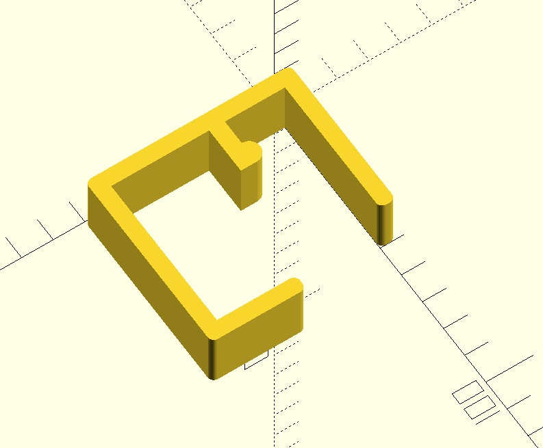
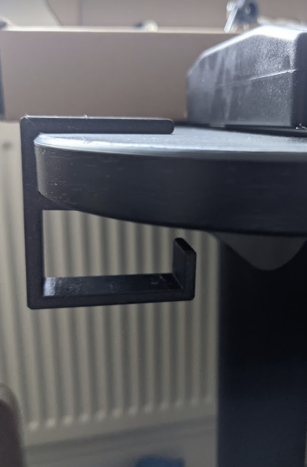

A simple clip for cables for your desk (that you don't want to drill holes in).

It looks like this:

To use:
  - Download roundedcube.scad from the [gist](https://gist.github.com/groovenectar/92174cb1c98c1089347e)
  - Save to same dir as cableclip.scad, open in openscad, adjust desk_thickness to taste, render, export STL.
  - Import to favourite slicer, print.
