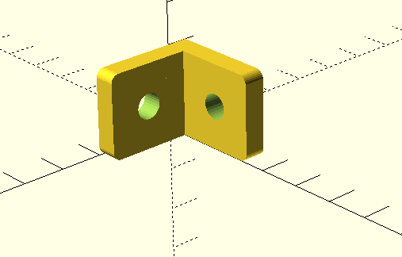

Some simple bits for simple jobs.

## lbracket 

To use:
  - Download roundedcube.scad from the [gist](https://gist.github.com/groovenectar/92174cb1c98c1089347e)
  - Save to here, open in openscad, render, export STL.
  - Import to favourite slicer, print.
