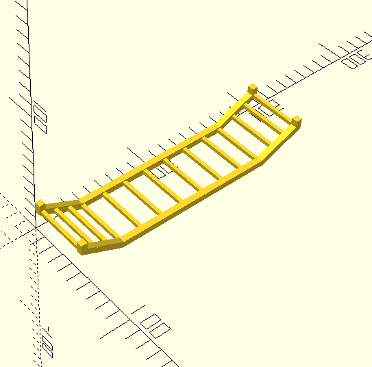

# Aw you Got Your Widdle Wadder?

[context](https://www.youtube.com/watch?v=_QbI3HEK2uo)

Edit the .scad file with your own values for how widdle you want your wadder to be, and slice in your slicer of choice.
